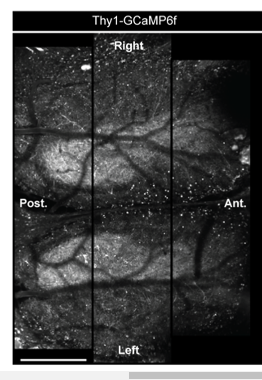
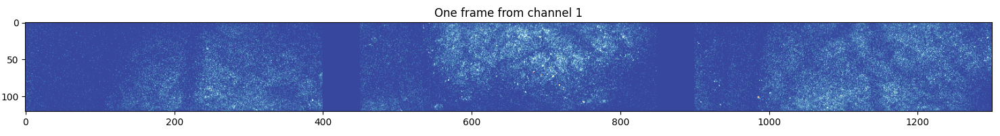
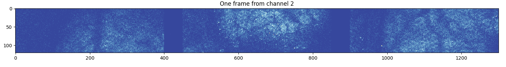

# Notes concerning the embargo2024 conversion
* 2-photon imaging data, .tiff files with ScanImage format([Raw Imaging](#raw-imaging))

## Raw Imaging 
### Method description from [Pre-print Ling 2023](https://www.biorxiv.org/content/10.1101/2023.04.24.538157v2):
Two-photon imaging was performed on a ThorLabs/Janelia 2P-RAM mesoscope. The laser wavelength was set to 920 nm to image GCaMP6f signals. Imaging parameters were controlled with ScanImage software. To maximize frame rates in each imaging session, fields of view were defined for acquisition that included a single plane visualizing only the dorsal surface of bilateral OBs (1800 um long x ~600um –wide fields of view that were tiled to cover a total field of view that was 1800-2500 um wide). Images were acquired continuously throughout experiments (during odor presentations, intertrial, and inter-block intervals), with 5um/pixel resolution at the fastest possible frame rate allowed by the imaging parameters (15-18 Hz). 

### From dataset
Frame dimension: 120x1300
 - 600 / 5 = 120 
 - 1800 / 5 = 360
 - 120 x 3 = 360
--> resulting frame should be 360x360 --> 1800x1800 um? If so how can the FOV be 1800x2500 um

From the paper there seems to be only one channel, what's the second channels used for?

